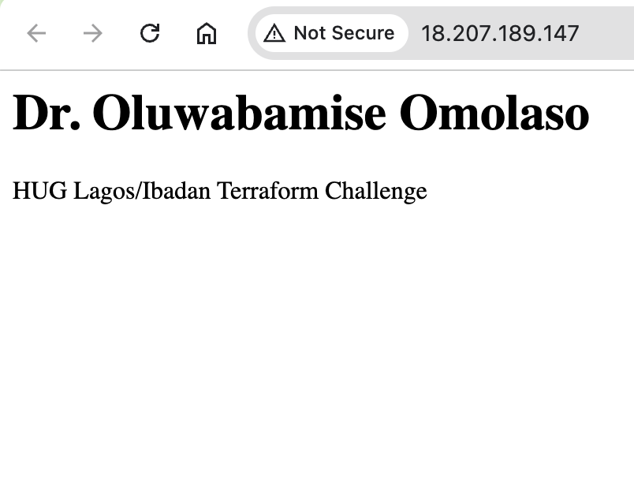
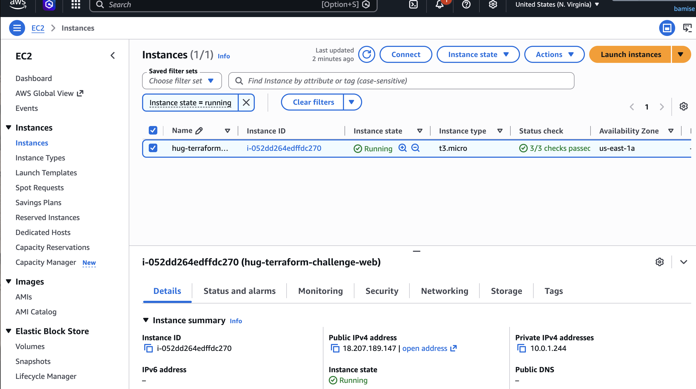

# HUG Lagos/Ibadan Terraform Challenge — Week One

This is my Week One project for the HUG Lagos/Ibadan Terraform Challenge.

I used Terraform to build a small web server on AWS: custom VPC, public subnet, security group (SSH + HTTP), and an EC2 instance that installs Nginx and serves a page with my name and the challenge title.

## What gets created

| Piece | File |
|--------|------|
| VPC `10.0.0.0/16`, public subnet `10.0.1.0/24`, IGW, route table (`0.0.0.0/0` → IGW), association, `map_public_ip_on_launch` | `network.tf` |
| Security group: inbound 22 and 80, outbound all | `security.tf` |
| Amazon Linux 2023 AMI lookup, `t3.micro` EC2, `user_data` (yum + Nginx + HTML) | `main.tf` |
| Public IP, DNS, instance ID, website URL | `outputs.tf` |

The HTML page shows:

- My full name (`full_name` variable)
- `HUG Lagos/Ibadan Terraform Challenge`

## Prerequisites

- Terraform `>= 1.14.0`
- AWS account and credentials configured locally (`aws sts get-caller-identity` should work)
- Region: default `us-east-1` (see `variables.tf` / `terraform.tfvars.example`)

## Deploy

1. Clone the repo and `cd` into it.

2. Copy example vars and edit your name if needed:

```bash
cp terraform.tfvars.example terraform.tfvars
```

`terraform.tfvars` is gitignored. Don’t commit it if you put secrets there later.

3. Initialize and review:

```bash
terraform init
terraform plan
```

4. Create the resources:

```bash
terraform apply
```

Type `yes` when asked.

5. Get the URL:

```bash
terraform output website_url
```

Open that link in a browser. Wait a minute or two after apply — `user_data` still has to install Nginx on first boot.

## Verify

- Browser: page shows your name and **HUG Lagos/Ibadan Terraform Challenge**
- AWS Console → EC2 → instance `hug-terraform-challenge-web` is **running**
- Optional: Instance diagnostics → System log — you should see yum installing nginx and cloud-init finishing (no `scripts-user` FAILED)

## Things I hit while building

- **AMI filter returned no results** when the name pattern was too specific (e.g. included `-gp2`). Fixed with `al2023-ami-*-x86_64` and `most_recent = true`.
- **First `user_data` failed** (nested heredoc / formatting). System log showed `Failed to run module scripts-user`. After fixing the script I recreated the instance with:

```bash
terraform apply -replace=aws_instance.ec2_instance
```

`user_data` only runs on first boot, so a replace/recreate is needed after changing it.

## Cleanup (save cost)

```bash
terraform destroy
```

Type `yes`. Your `.tf` files stay; run `terraform apply` again when you need screenshots or a live demo.

## Screenshots

Put image files in the `screenshots/` folder using these names (PNG or JPG is fine — update the extension below if needed).

### Webpage

Nginx page showing my name and **HUG Lagos/Ibadan Terraform Challenge**.



### EC2 instance running

AWS Console → EC2 → instance in **running** state.



## Challenge deliverables

This repo is the Terraform code + deploy steps + screenshots above.